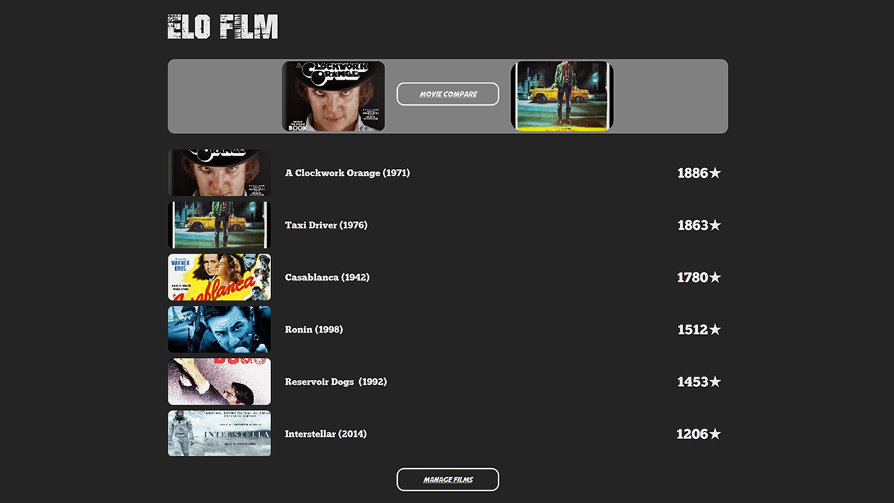

# ELO FILM
"Elo Film" will be a small application created with JavaFX to rate movies using the Elo rating system

Websites like IMDB and Rotten Tomatoes are one of the best ways to find out if a movie or TV series is worth watching. Users
can rate movies they have seen, and based on these ratings we can get a general idea of what a movie is like.
Users will also have their own rating table that shows which movies they like the most or least.
 
A very common problem is the case where a user has rated one movie 8 (out of 10) and now rates another movie
9, but then realizes that the second movie is not really better than the first,
therefore the rating for one of the films should be adjusted.
### Elo rating System
Elo rating is a method of calculating the rating value of two opponents based on their previous rating and the result of their match.
The method can be used in zero-sum game situations, i.e. the win of one equals the loss of the other.
It was invented as a new chess rating system, but it is also used for many other sports.
 <i> see  [Elo rating system](https://en.wikipedia.org/wiki/Elo_rating_system).

